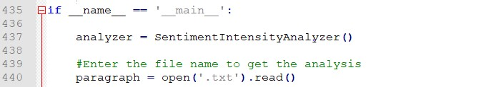

# INTELLIMIND Challenge

## Part 1

Here Sentiment Analysis and Named Entity Extraction of the documents
given is done. For that we first need to do a basic pre-processing of
the document.

Pre-processing of the text involves:

1.  Tokenizing the text. This can be done in two ways:
- Sentence tokenize
- Word tokenize

2.  Removing unnecessary words from the text that does not contribute to
    the overall meaning

3.  Lemmatization which involves getting the root word for which the
    machine has been trained

### Sentiment Analysis

Here we need to find the overall sentiment of the text i.e. whether the
context has some positive essence or a negative one.

The text is pre-processed and the intent behind the individual sentences
is determined and scored.

The scoring is done based on the words used in the text and how they are
used i.e. in a positive meaning or a negative sense.

The main aim is to get this positive or negative sense because in
English there are many meanings to the same word and even the same word
combined with some other words can give a completely different sense.

For this you need to run the Sentiment\_Analysis.py code in Part1
folder.

Here you need to provide the file name for which you want to do the
Sentiment Analysis

It analysis the text and returns you whether the document had a positive
,negative or a neutral sense.

As you will see in the code we use a dictionary of words( also
combination of words) for which polarity has been defined. Based on this
a score is generated and sentiment of the document can be known

The whole emphasis is on getting the polarity. Various punctuations and
conjunctions also add to meaning and thus affect the polarity score. All
this is analyzed and the final answer is generated

Following table gives sentiment analysis for the given sample dataset:

| **Document** | **Sentiment** |
|--------------|---------------|
| 1.txt        | Neutral       |
| 2.txt        | Neutral       |
| 3.txt        | -ve           |
| 4.txt        | +ve           |
| 5.txt        | -ve           |
| 6.txt        | Neutral       |
| 7.txt        | +ve           |
| 8.txt        | +ve           |
| 9.txt        | +ve           |
| 10.txt       | +ve           |

Test cases for the same are also included

### Named Entity Extraction

This helps in classifying the text into various categories like persons,
organizations, quantities etc.

For this first pre-processing is done. Then Parts of Speech(POS) tagging
is done which classifies the words as nouns, verbs and so on.

Based on this tagging the words are extracted and placed in their
respective categories

nltk.ne\_chunk function is used to get a nested tree object from which
extraction of named entity is done

## Part 2

Attached is a design for personal assistant like system similar to Siri,
Alexa, Cortana
